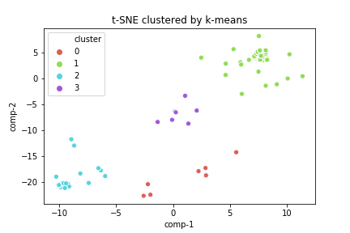

# ICU Mortality Prediction
A risk assessment tool to improve outcomes in the ICU

In this project I use ensemble learning to predict mortality with open source ICU data. Features include basic demographic information,
lab values, vital signs and health comorbidities, as well as risk assessment scores from other severtiy-of-disease systems such as APACHE

I've selected the XGBoost ensemble learning model for its versitility and speed.
hyperparameter tuning was performed through gridsearch and feature selected was performed through iterative random search.
The selected evaluation metric is area under the receiving operator characteristic curve (ROC-AUC)

**Training Data AUC: 0.9077**

See notebook for details [icu_risk_assessment.ipynb](https://github.com/Gabriel-Aspen/icu/blob/main/icu_risk_assessment.ipynb)

Data can be found [here](https://www.kaggle.com/c/widsdatathon2020/data)

### Patient clustering with t-distributed stochastic neighbor embedding (t-SNE) and k-means
Dimesionality reduction performed using comorbity information on patients with one or more comorbidity (AIDS, Diabetes etc.)
and clustered with k-means. 

See notebook for details [dimensionality_reduction.ipynb](https://github.com/Gabriel-Aspen/icu/blob/main/dimensionality_reduction.ipynb)
